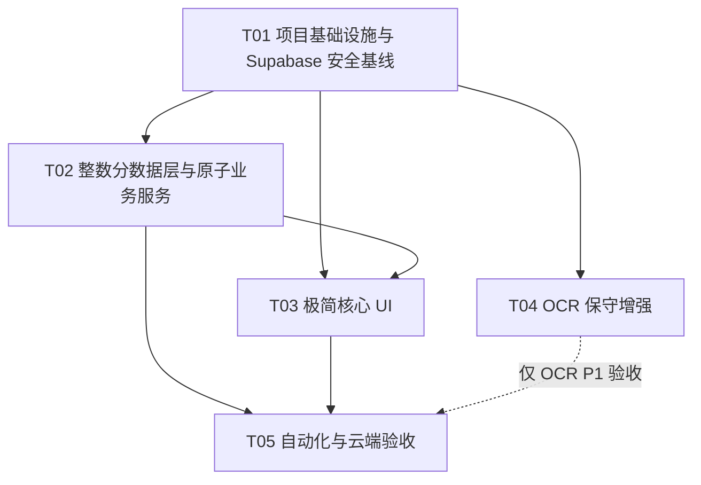

# 得物个人进销存极简化——增量架构设计与任务分解

> 项目：`dewu-pms`
> 角色：高见远（Gao）·架构师
> 输入基线：`docs/incremental-prd-simple.md`、`HANDOFF.md` 与当前源码
> 设计目标：在保留 Next.js 16、React 19、Tailwind CSS v4、8 状态任意直达和现有页面骨架的前提下，以最小增量完成“进价—均摊寄出快递费—到手价”闭环，并将 Supabase 变成唯一正式数据源。

---

# Part A：系统设计

## 1. 实施方案（Implementation Approach）

### 1.1 现状与核心难点

当前项目已有可复用的 `DbAdapter`、采购服务、状态服务、利润纯函数、6 张表和 Tesseract.js OCR，但与简版 PRD 有以下关键差距：

1. **金额仍以元的小数 `number/numeric(10,2)` 运算**：`round2` 只能降低而不能消除浮点误差，无法为运费整数分守恒提供强保证。
2. **现有批量状态更新不是原子操作**：`batchChangeStatus` 逐件调用并收集失败，可能留下“部分成功”；批量寄出必须改为单次事务 RPC。
3. **寄出运费的生命周期早于销售记录**：当前 `sales.express_fee` 只有创建销售记录后才存在，而且状态回转、退款或删除销售记录时会消失，不能可靠表示“寄件时已发生的单件分摊成本”。
4. **正式数据源行为不符合要求**：`getDb()` 未配置 Supabase 时静默使用 localStorage/IndexedDB，页面加载也多处吞错；这会形成云端/本地两份完整数据并掩盖连接失败。
5. **现有 Supabase 安全边界不足**：所有表与公开 Storage bucket 对 `anon` 全开放。部署地址或 key 泄露即可被任意读写；anon key 本应是公开客户端凭据，安全必须由 Auth + RLS 保证。
6. **跨表操作缺少事务**：采购新增、状态+销售+历史、退款、误录删除、清库均由多次客户端请求拼接，任一步失败会留下中间态。
7. **附件是多态关联**：`attachments.owner_type/owner_id` 没有真实外键；数据库事务也不能和 Storage 对象删除形成分布式原子事务，需要可重试清理队列。
8. **UI 仍暴露复杂金额**：添加页有采购运费/优惠，销售表单有售价、平台费、补贴、快递费和其他费；详情、报表、CSV 也仍展示预计利润与复杂字段。
9. **退款语义需收紧**：现逻辑保留销售记录中的售价，只清到账；PRD 要求采购平台退款作废销售结算数据，同时保留商品、进价、退款状态、操作时间、可选备注。
10. **没有自动化测试基础**：当前无 `test/spec` 文件，整数分算法、报表排除、RPC 原子语义等高风险规则没有回归保护。

### 1.2 最小数据模型决策

#### 决策：在 `inventory_units` 新增 `outbound_shipping_cents`，不复用 `sales.express_fee`，P0 不建寄件批次表

```text
actual_profit_cents = actual_payout_cents
                    - unit_cost_cents
                    - outbound_shipping_cents
```

理由：

- 运费在“寄出”时发生，此时通常尚无 `sales` 行；强行创建空销售行会破坏销售统计和 1:1 语义。
- 当前状态服务在离开销售态或采购退款时会删除销售记录；将运费放在 `sales` 会造成成本丢失。
- 库存页/详情页在未售时就需要展示已均摊运费，放在单件库存读取最直接。
- P0 只需要每件当前分摊值与覆盖确认；寄件批次的总价、成员审计是 PRD P2。现在建 `shipping_batches` 会增加表、关联、删除和 UI 成本。
- 字段默认 `0`，重复寄出通过“任一选中件该字段 > 0”判定需要覆盖确认；确认后覆盖而不是累加。

#### 整数分字段

**业务模型的最小新增仅为 `inventory_units.outbound_shipping_cents` 一个字段；不增加寄件批次实体。** 另外，鉴于本次明确从空库开始，为消除全站表示歧义，迁移同步把既有金额列重命名/改型为 `bigint` 分。后者是金额表示标准化，不增加业务实体或关系；相比长期保留“数据库元、领域分”的双单位映射更简单、更不易误用。所有金额字段统一使用 `_cents` 后缀：

- `purchase_batches.unit_price_cents`：单件进价；新增记录直接写入 `inventory_units.unit_cost_cents`。
- `purchase_batches.shipping_fee_cents`、`discount_amount_cents`：仅为旧结构兼容保留，新 UI 不展示，新记录恒为 0。
- `inventory_units.unit_cost_cents`、`listing_price_cents`、`outbound_shipping_cents`。
- `sales.sold_price_cents`、`platform_fee_cents`、`platform_subsidy_cents`、`express_fee_cents`、`other_fee_cents`、`actual_payout_cents`。除 `actual_payout_cents` 外，新增销售记录均写 0/空；旧字段不再进入利润公式。

数据库约束：所有金额 `>= 0`，JS 侧要求 `Number.isSafeInteger`；单件金额远低于安全整数上限。金额输入使用字符串严格解析，最多两位小数，禁止直接 `Number(text) * 100`。

### 1.3 框架、库与模式选择

- **Next.js 16 App Router + React 19**：沿用现有项目，不引入新的前端框架。
- **Tailwind CSS v4**：沿用苹果简约视觉，复用 `Card/Sheet/Field`，不引入 MUI 以避免与现有样式体系重复和增加包体。
- **`@supabase/supabase-js` 2.x**：继续负责 Auth、PostgREST、RPC 和 Storage；写入复合业务操作统一通过 PostgreSQL RPC。
- **PostgreSQL PL/pgSQL RPC + RLS**：批量寄出、退款、误录删除、清空、状态+销售+历史在数据库内完成原子事务；客户端不得逐件提交关键批量业务。
- **函数式分层 + Adapter/Service 模式**：页面只管理交互；`services/*` 编排业务；`data/*` 只处理持久化；`utils/*` 为无副作用算法。保持现有风格，不为“面向对象”额外制造运行时类。
- **Vitest + Testing Library**：测试金额、分摊、报表和 React 表单；使用仅测试环境的 `MemoryDbAdapter`，不再使用 localStorage 作为生产替身。
- **Playwright**：覆盖 390px iPhone 视口核心链路和断网写失败。
- **Tesseract.js 7**：本轮保留，OCR 仍为 P1 辅助功能；不让引擎替换阻塞 P0。

架构分层：

```text
App Router 页面/组件
  ↓（用户输入、加载/错误/重试状态）
业务服务 purchase/shipping/status/maintenance
  ↓（单次原子业务接口）
DbAdapter
  ├─ SupabaseAdapter（正式运行唯一实现）→ Auth + RLS + RPC + Private Storage
  └─ MemoryDbAdapter（测试专用，不持久化、不打入生产选择逻辑）
```

### 1.4 原子性策略

#### 云端正式实现

所有复合写操作由 `security definer` RPC 执行，并固定：

- `set search_path = public, pg_temp`；
- 首行校验 `auth.uid() is not null`；
- 所有查询和修改都带 `user_id = auth.uid()`；
- 对目标库存使用 `SELECT ... FOR UPDATE`；
- 校验传入 ID 去重后数量与实际命中数量完全一致，否则抛错并回滚；
- 状态、销售、历史和附件清理队列在一个 PostgreSQL 事务内完成；
- 不接收客户端传入的 `user_id`。

核心 RPC：

```ts
ship_units(input: ShipUnitsInput): Promise<ShipUnitsResult>
settle_units(input: SettleUnitsInput): Promise<void>
refund_unit(input: RefundUnitInput): Promise<void>
delete_unit_deep(input: DeleteUnitInput): Promise<DeleteResult>
clear_all_data(input: { confirmation: "清空" }): Promise<ClearResult>
ack_storage_deletions(input: { paths: string[] }): Promise<void>
```

PostgREST RPC 本身即单条数据库事务；函数中任何 `raise exception` 会回滚所有结构化数据变更。

#### 本地测试替身

`MemoryDbAdapter` 仅用于 Vitest，不在 `getDb()` 中作为运行时回退。其原子方法采用 copy-on-write：

1. 深拷贝当前内存状态；
2. 在副本上校验并完成所有变更；
3. 全部成功后一次替换原状态；
4. 注入失败时丢弃副本，用于验证“0 件部分写入”。

### 1.5 批量运费整数分算法与接口

```ts
export interface ShippingCandidate {
  id: string;
  createdAt: string; // ISO 8601
  currentShippingCents: number;
}

export interface ShippingAllocation {
  unitId: string;
  shippingCents: number;
}

export interface ShipUnitsInput {
  unitIds: string[];
  totalShippingCents: number;
  overwriteConfirmed: boolean;
}

export interface ShipUnitsResult {
  allocations: ShippingAllocation[];
  totalShippingCents: number;
  overwrittenUnitIds: string[];
}

export function allocateShippingCents(
  candidates: ShippingCandidate[],
  totalShippingCents: number,
): ShippingAllocation[];
```

算法：

1. 验证 `N >= 1`、ID 唯一、`totalShippingCents` 为安全非负整数。
2. 按 `createdAt ASC`，相同再按 `id ASC` 排序。
3. `q = Math.floor(T / N)`，`r = T % N`。
4. 排序后索引 `< r` 的商品分配 `q + 1`，其余分配 `q`。
5. 断言 `sum === T` 且 `max - min <= 1`；返回排序后的预览。

前端纯函数用于即时预览；RPC 必须用相同排序和算法重新计算，不能信任客户端提交的 allocations。RPC 锁定后若发现任一 `outbound_shipping_cents > 0` 且 `overwrite_confirmed=false`，返回/抛出明确覆盖确认错误；确认后覆盖原值并将所有目标状态原子改为 `shipping`，为每件插入历史（即使原状态已是 `shipping`，也记录“覆盖寄出运费”，状态值可保持不变）。

### 1.6 删除、退款与全库清空

#### 误录硬删除 `delete_unit_deep`

事务内：

1. 锁定且验证该单件属于当前用户；读取 `batch_id/product_id`、关联 sale ID。
2. 将 unit、sale 的附件路径写入 `storage_deletion_jobs`；若删除后批次为空，把 batch 附件也入队并删除空 batch；若商品再无 batch/unit 引用，把 product 附件入队并删除孤立 product。
3. 删除 inventory unit；数据库外键 `sales.unit_id ON DELETE CASCADE`、`status_history.unit_id ON DELETE CASCADE` 清关联事实。
4. 删除多态 `attachments` 元数据；返回待删 Storage paths。
5. 客户端调用 private bucket `remove(paths)`；成功后 `ack_storage_deletions`。失败则明确显示“业务记录已删除，N 个附件待清理”，设置页提供重试。不能宣称全部完成。

已售/已结算与普通记录共用同一 RPC，仅确认文案更强；refunded 仍允许彻底删除。

#### 采购平台退货退款 `refund_unit`

事务内锁行；删除该 unit 的 `sales` 行（不是只清到账）；更新 `status='refunded'`；保留 `unit_cost_cents`；插入一条 `status_history`，`note` 保存可选退款备注。报表和资产统一按 `refunded` 排除。若之后任意直达其他状态，按现有状态规则允许，但不会恢复已作废销售数据。

#### 清空全部数据 `clear_all_data`

- 只清当前 `auth.uid()` 的数据，不影响其他账户。
- 必须传入精确确认词“清空”。
- RPC 先把全部附件路径写入 `storage_deletion_jobs`，再按依赖顺序/级联删除 sales、history、attachments、units、batches、products；结构化数据全成或全败。
- 客户端批量删除返回 paths 并确认清理任务。Storage 无法与 PostgreSQL 做分布式事务，因此“结构化数据事务 + 持久化可重试附件清理队列 + 明确报告剩余项”是可恢复且不虚假报成功的方案。
- 清库成功后清除 React 内存缓存、sessionStorage OCR 回填和旧 `pms_*` localStorage/IndexedDB 残留，防止刷新后旧本地业务数据“复活”；这些本地残留不再被读取为正式数据。

### 1.7 Supabase 空库安全方案

1. **身份认证**：采用 Supabase Auth 邮箱登录（magic link 或密码二选一，实施默认 magic link）；先创建个人账户并在生产项目关闭开放注册，避免资源滥用。匿名访问只能到登录页。
2. **数据归属**：6 张业务表及清理队列增加 `user_id uuid not null references auth.users(id)`；插入默认 `auth.uid()` 只能在 RPC 内设置。
3. **RLS**：只允许 `authenticated` 且 `user_id = auth.uid()` 的 `select`；关键写入仅允许 RPC，表级客户端 insert/update/delete 不授予或不建策略。绝不保留 `anon all`。
4. **Storage**：`attachments` bucket 改为 private；路径固定 `${auth.uid()}/${ownerType}/${ownerId}/${uuid}`；policy 要求首段目录等于 `auth.uid()`；读取使用短期 signed URL，不再 `getPublicUrl()`。
5. **客户端配置**：浏览器只使用 `NEXT_PUBLIC_SUPABASE_URL` 与可公开的 anon/publishable key；绝不把 `service_role` 放进前端。迁移/运维使用 Supabase CLI 或 Dashboard 的受控权限。
6. **连接行为**：`getDb()` 未配置时抛出 `ConfigurationError` 并渲染“Supabase 未配置”；未登录渲染登录页；网络/鉴权/RLS 错误映射成可重试错误。不得实例化 LocalAdapter，不得吞错后渲染假空态。
7. **离线行为**：P0 不支持离线写；可保留当前 React 内存画面，但所有写按钮在 `navigator.onLine=false` 时禁用并提示联网。刷新后无法联网则显示错误页，不从本地完整数据库恢复。
8. **迁移策略**：保留已存在的 `0001_init.sql` 作为历史基线，新增 `0002_simple_secure.sql`。因用户允许清空，迁移先显式删除旧业务数据，再改为 cents 字段、补 user_id/约束/级联/RLS/RPC/私有 bucket。新项目通过 Supabase CLI 顺序执行 0001+0002；不要修改已可能执行过的迁移历史。

### 1.8 UI 增量方案

- **登录页**：未认证时只显示邮箱登录和错误/重试；已认证进入应用。
- **添加页**：默认财务输入仅“进价（元）”；数量仍表示生成 N 个单件；采购运费、优惠从 UI 移除，服务写 0，`unit_cost_cents=unit_price_cents`。
- **库存页**：卡片显示进价、已均摊运费、到手价或“未结算”；批量固定栏提供并列“批量寄出”和“改状态”。批量寄出 Sheet 只有总运费、数量、稳定分摊预览、合计和变为 shipping 的提示；覆盖时追加二次确认。
- **销售 Sheet**：默认只输入“实际到手价”和日期；提交后直达 `settled`。如用户只想直达 `sold`，仍可通过 8 状态选择器直接设为 sold，页面显示“未结算”，不强迫录金额。所有遗留销售费用写 0。
- **详情页**：采购区只突出进价、均摊寄出快递费；实际到账为空时明确“未结算”；新增“采购退货退款”和“删除此记录”，文案不可混用。
- **组页**：保留数量和全组状态直达，但 `-1` 也必须改走深删除 RPC并显示确认，避免绕过孤立父记录/附件清理；组内金额遵循新口径。
- **首页/报表**：只统计非 refunded 的有效记录；删除后重新拉取。移除预计利润、平台费、补贴等复杂指标和 CSV 列；未到账不以 0 利润计入。
- **设置页**：显示登录账户、Supabase 连接状态、附件待清理数量和“重试清理”；危险区提供输入“清空”的清库操作。入口加入底部导航或首页设置按钮，390px 不横溢。

### 1.9 OCR 技术决策

#### 本轮决定

**继续实施现有 Tesseract.js 7 + 正则解析 + 人工校对，不在 P0/P1 本轮替换引擎。** 同时修正 worker 生命周期（同页复用 worker，离页终止，而不是每张图重新下载/初始化）并补字段置信/空值提示。理由：

- 已经集成且纯浏览器运行，不上传订单截图，隐私边界清晰。
- 官方仓库明确支持浏览器/Node.js，WASM 部署与当前 Next.js 客户端页匹配；许可证 Apache-2.0。
- 官方也明确其只是 Tesseract 的 WASM 包装，不修改识别模型提高准确率；因此只能作为候选值工具，不能承诺中文订单截图达到 PRD 门槛。
- PaddleOCR/RapidOCR 的实际替换要么新增服务端推理与运维，要么引入 ONNX/WASM 模型下载、内存和 Safari 稳定性验证；没有 100 张脱敏样本和测试机数据时直接替换风险高。

#### 候选对比（调研日期：2026-08-02）

| 方案 | 维护状态证据 | 许可证 | 运行形态/浏览器适配 | 本项目实际集成成本与结论 |
|---|---|---|---|---|
| Tesseract.js | 官方仓库仍有 v7、CI/维护徽章和浏览器文档；当前项目已用 7.0.0 | Apache-2.0 | 官方支持浏览器 webpack/ESM/CDN 和 Node.js，WASM；不支持 PDF，也不改核心模型提升准确率 | **低**。保留为本轮方案；优化 worker 复用、错误提示和真实样本评测。iPhone 中文准确率与耗时必须实测 |
| PaddleOCR | 官方仓库有 6,900+ commits，并列出 2026-07 更新、PP-OCRv6/PaddleOCR.js 等活跃内容 | Apache-2.0 | 主工具链以 Python/本地部署为主，官方仓库已有 `paddleocr-js`，但浏览器模型/后端与主 Python 生态并非同等成熟、轻量 | **中高/高**。服务端 Python 最现实，但需要图片上传许可、计算托管、API 鉴权和运维；纯浏览器需单独量模型体积、首载、内存和 Safari 崩溃 |
| RapidOCR | 官方仓库约 1,500+ commits，覆盖 python/cpp/dotnet/jvm/android/ios/ocrweb，定位为 PaddleOCR 模型转 ONNX 的跨平台部署 | Apache-2.0 | ONNX Runtime/OpenVINO/MNN/Paddle/TensorRT/PyTorch，多语言；仓库含 `ocrweb`，但生产 Web/iPhone Safari 仍需自行选择 runtime 和模型 | **中**。比完整 PaddleOCR 服务更轻，但 Web 端仍需 ONNX/WASM、模型静态资源、内存与兼容验证；作为下一轮 PoC 首选替代候选 |

来源：

- PaddleOCR 官方仓库：<https://github.com/PaddlePaddle/PaddleOCR>
- RapidOCR 官方仓库：<https://github.com/RapidAI/RapidOCR>
- Tesseract.js 官方仓库：<https://github.com/naptha/tesseract.js>

下一步只有在取得不少于 100 张脱敏标注截图后，使用固定字段准确率/召回率、单张耗时、5 张连续稳定性对 Tesseract.js 与 RapidOCR Web PoC 做同机对比；若允许服务端上传，再加入 PaddleOCR Python。OCR 评测不阻塞 P0。

---

## 2. 完整文件列表（File List）

以下为本增量需要新增或修改的完整相对路径；未列出的通用 UI 保持不动。

```text
# 基础设施 / 配置
package.json                                      # 增加 test/e2e/typecheck 脚本和测试依赖
package-lock.json                                 # 锁定依赖
.env.example                                      # Supabase URL/key/redirect 配置模板
vitest.config.ts                                  # 单元/组件测试配置
playwright.config.ts                              # 390px E2E 配置
src/app/layout.tsx                                # Auth/数据源门禁与全局错误边界接入
src/components/layout/BottomNav.tsx               # 设置入口

# 数据库 / 数据层
supabase/migrations/0002_simple_secure.sql        # 清空旧数据、cents、user_id、RLS、RPC、私有 Storage
src/lib/types/database.ts                         # cents/user_id/outbound shipping/cleanup job 类型
src/lib/data/types.ts                             # 原子接口与输入输出类型
src/lib/data/index.ts                             # 正式环境强制 Supabase，禁止本地回退
src/lib/data/cloud.ts                             # RPC、私有附件 signed URL、清理接口
src/lib/data/memory.ts                            # 新增：测试专用 copy-on-write adapter
src/lib/data/errors.ts                            # 新增：配置/网络/鉴权/RLS 可读错误
src/lib/supabase/client.ts                        # Auth 配置与客户端单例
src/lib/supabase/auth.ts                          # 新增：session/login/logout 辅助

# 核心业务 / 工具
src/lib/services/purchase.ts                      # 极简采购、原子 create RPC、成本=进价
src/lib/services/shipping.ts                      # 新增：整数分预览与批量寄出服务
src/lib/services/status.ts                        # 状态/结算/退款改走原子接口
src/lib/services/maintenance.ts                   # 新增：深删除、清库、附件重试
src/lib/utils/money.ts                            # 新增：严格元↔分解析/格式化
src/lib/utils/profit.ts                           # 唯一利润公式，返回 cents/null
src/lib/reports.ts                                # 排除退款、仅实际利润、cents CSV
src/lib/ocr.ts                                    # worker 复用、字段候选/置信提示

# 页面 / 组件
src/app/login/page.tsx                            # 新增：Supabase Auth 登录
src/app/page.tsx                                  # 简版首页统计、连接错误不吞掉
src/app/add/page.tsx                              # 只保留进价财务输入
src/app/add/ocr/page.tsx                          # 人工确认与 worker 生命周期
src/app/inventory/page.tsx                        # 批量寄出入口、错误/重试
src/app/inventory/[id]/page.tsx                   # 运费/到账/利润、退款、深删除
src/app/inventory/group/page.tsx                  # cents 分组、深删除数量减少、简版金额
src/app/reports/page.tsx                          # 只展示实际结算口径
src/app/settings/page.tsx                         # 新增：连接状态/登录/清库/附件清理
src/components/ui/BatchShippingSheet.tsx          # 新增：总运费、预览、覆盖确认
src/components/ui/DeleteUnitSheet.tsx             # 新增：普通/已售差异确认
src/components/ui/SaleFormSheet.tsx               # 只输入到手价与日期
src/components/ui/UnitCard.tsx                    # 进价/运费/到手价或未结算
src/components/ui/GroupCard.tsx                   # 新口径组汇总
src/components/ui/DataSourceGate.tsx              # 新增：配置/登录/离线/连接门禁

# 自动化测试
src/lib/utils/money.test.ts                       # 元分解析边界
src/lib/services/shipping.test.ts                 # 分摊守恒/稳定顺序/覆盖/回滚
src/lib/utils/profit.test.ts                      # 唯一公式/null/refunded 场景
src/lib/reports.test.ts                           # 退款和未结算排除、删除重算
src/lib/services/maintenance.test.ts              # 深删除、孤立父级、清库、清理队列
src/components/ui/BatchShippingSheet.test.tsx     # 预览与二次确认
src/components/ui/SaleFormSheet.test.tsx          # 极简字段与提交 payload
e2e/simple-flow.spec.ts                           # 390px 采购→寄出→结算→退款/删除→清库
e2e/offline-and-auth.spec.ts                      # 未登录/RLS/断网无静默回退
```

---

## 3. 数据结构与接口（Mermaid classDiagram）

> Mermaid 使用 class 语法表示 TypeScript interface、数据库实体和函数式 service module；实现继续采用现有函数式模块，不要求实例化业务类。

```mermaid
classDiagram
  direction LR

  class Product {
    <<entity>>
    +string id
    +string user_id
    +string name
    +string? style_code
    +string? brand
    +string created_at
    +string updated_at
  }

  class PurchaseBatch {
    <<entity>>
    +string id
    +string user_id
    +string product_id
    +Platform platform
    +string? order_no
    +number unit_price_cents
    +number quantity
    +number shipping_fee_cents
    +number discount_amount_cents
    +string purchased_at
    +string? note
  }

  class InventoryUnit {
    <<entity>>
    +string id
    +string user_id
    +string batch_id
    +string product_id
    +string size
    +number unit_cost_cents
    +number? listing_price_cents
    +number outbound_shipping_cents
    +UnitStatus status
    +string created_at
    +string updated_at
  }

  class Sale {
    <<entity>>
    +string id
    +string user_id
    +string unit_id
    +number? sold_price_cents
    +number platform_fee_cents
    +number platform_subsidy_cents
    +number express_fee_cents
    +number other_fee_cents
    +number? actual_payout_cents
    +string? sold_at
    +string? settled_at
  }

  class StatusHistory {
    <<entity>>
    +number id
    +string user_id
    +string unit_id
    +UnitStatus? from_status
    +UnitStatus to_status
    +string? note
    +string created_at
  }

  class Attachment {
    <<entity>>
    +string id
    +string user_id
    +AttachmentOwner owner_type
    +string owner_id
    +AttachmentKind kind
    +string path
    +string? content_type
  }

  class StorageDeletionJob {
    <<entity>>
    +string id
    +string user_id
    +string path
    +string created_at
    +string? completed_at
  }

  class DbAdapter {
    <<interface>>
    +kind "supabase"|"memory"
    +listUnits() Promise~InventoryUnit[]~
    +createPurchase(input) Promise~PurchaseResult~
    +shipUnits(input) Promise~ShipUnitsResult~
    +settleUnits(input) Promise~void~
    +refundUnit(input) Promise~void~
    +deleteUnitDeep(input) Promise~DeleteResult~
    +clearAllData(input) Promise~ClearResult~
    +saveAttachment(input) Promise~Attachment~
    +attachmentUrl(att) Promise~string~
    +retryStorageCleanup() Promise~CleanupResult~
  }

  class SupabaseAdapter {
    <<adapter>>
    -SupabaseClient client
    +constructor(client)
    +shipUnits(input)
    +deleteUnitDeep(input)
    +clearAllData(input)
    +attachmentUrl(att)
  }

  class MemoryDbAdapter {
    <<test adapter>>
    -MemoryState state
    +constructor(seed?)
    -transaction(fn)
    +shipUnits(input)
    +deleteUnitDeep(input)
    +clearAllData(input)
  }

  class MoneyUtils {
    <<module>>
    +parseYuanToCents(text) number
    +formatCents(cents) string
    +assertCents(value) void
  }

  class PurchaseService {
    <<module>>
    +createPurchase(db, input) Promise~PurchaseResult~
  }

  class ShippingService {
    <<module>>
    +allocateShippingCents(candidates, total) ShippingAllocation[]
    +previewShipping(units, total) ShippingPreview
    +shipUnits(db, input) Promise~ShipUnitsResult~
  }

  class StatusService {
    <<module>>
    +changeUnitStatus(db, unit, to, options) Promise~void~
    +settleUnits(db, input) Promise~void~
    +refundUnit(db, input) Promise~void~
  }

  class MaintenanceService {
    <<module>>
    +deleteUnitDeep(db, input) Promise~DeleteResult~
    +clearAllData(db, confirmation) Promise~ClearResult~
    +retryStorageCleanup(db) Promise~CleanupResult~
  }

  class ProfitCalculator {
    <<module>>
    +actualProfitCents(unitCost, shipping, payout) number?
    +unitProfit(unit, sale) ProfitResult
  }

  Product "1" --> "0..*" PurchaseBatch : owns
  Product "1" --> "0..*" InventoryUnit : classifies
  PurchaseBatch "1" --> "1..*" InventoryUnit : contains
  InventoryUnit "1" --> "0..1" Sale : settles
  InventoryUnit "1" --> "1..*" StatusHistory : records
  Attachment ..> Product : polymorphic owner
  Attachment ..> PurchaseBatch : polymorphic owner
  Attachment ..> InventoryUnit : polymorphic owner
  Attachment ..> Sale : polymorphic owner
  StorageDeletionJob ..> Attachment : cleans object path

  DbAdapter <|.. SupabaseAdapter : implements
  DbAdapter <|.. MemoryDbAdapter : implements
  PurchaseService --> DbAdapter
  ShippingService --> DbAdapter
  StatusService --> DbAdapter
  MaintenanceService --> DbAdapter
  PurchaseService --> MoneyUtils
  ShippingService --> MoneyUtils
  ProfitCalculator --> InventoryUnit
  ProfitCalculator --> Sale
```



---

## 4. 程序调用流程（Mermaid sequenceDiagram）

```mermaid
sequenceDiagram
  autonumber
  actor U as 用户
  participant Gate as DataSourceGate
  participant Auth as Supabase Auth
  participant Page as 页面/Sheet
  participant Svc as 业务 Service
  participant DB as SupabaseAdapter
  participant RPC as PostgreSQL RPC
  participant Store as Private Storage

  rect rgb(245, 245, 247)
    Note over U,DB: 初始化与读取
    U->>Gate: 打开应用
    Gate->>Auth: getSession()
    alt 未配置 Supabase
      Gate-->>U: 阻断页：Supabase 未配置（不回退本地）
    else 未登录
      Gate-->>U: 登录页
      U->>Auth: 邮箱登录
      Auth-->>Gate: authenticated session
    else 已登录
      Gate->>DB: listUnits/products/batches/sales/history()
      DB-->>Gate: 当前 user_id 的数据
      Gate-->>U: 页面或可重试错误
    end
  end

  rect rgb(238, 248, 255)
    Note over U,RPC: 新增采购
    U->>Page: 输入商品、单件进价、数量并确认
    Page->>Svc: createPurchase(db, PurchaseInput)
    Svc->>Svc: parseYuanToCents(); unitCost=unitPrice
    Svc->>DB: createPurchase(input)
    DB->>RPC: rpc(create_purchase_simple)
    RPC->>RPC: 校验 auth/RLS；创建 product/batch/N units/history（事务）
    RPC-->>DB: PurchaseResult
    opt 有附件
      DB->>Store: upload uid/owner/id/file
      alt 上传或元数据失败
        DB-->>Page: 明确失败/可重试，不显示全部成功
      end
    end
    DB-->>Page: 成功
    Page-->>U: 返回库存
  end

  rect rgb(255, 248, 232)
    Note over U,RPC: 批量寄出与整数分均摊
    U->>Page: 选择 N 件，输入总运费
    Page->>Svc: previewShipping(units, totalText)
    Svc->>Svc: parseYuanToCents + allocateShippingCents
    Svc-->>Page: 稳定顺序预览、合计
    alt 存在旧分摊
      Page-->>U: 二次确认“覆盖原分摊值”
    end
    U->>Page: 确认寄出
    Page->>Svc: shipUnits(db, unitIds,total,overwriteConfirmed)
    Svc->>DB: shipUnits(input)
    DB->>RPC: rpc(ship_units)
    RPC->>RPC: auth校验；FOR UPDATE；重算分摊；更新运费+shipping；写history
    alt 任一校验/更新失败
      RPC-->>DB: exception，整笔回滚
      DB-->>Page: 可重试错误
    else 全部成功
      RPC-->>DB: allocations（sum=T）
      DB-->>Page: ShipUnitsResult
      Page-->>U: 刷新后显示固定分摊
    end
  end

  rect rgb(239, 252, 242)
    Note over U,RPC: 售出结算 / 任意状态直达
    alt 录入实际到手价
      U->>Page: 输入到手价与日期
      Page->>Svc: settleUnits(db,input)
      Svc->>DB: settleUnits(payoutCents,date)
      DB->>RPC: rpc(settle_units)
      RPC->>RPC: upsert sale(其他费=0)；unit->settled；history
      RPC-->>Page: committed
      Page->>Svc: actualProfitCents(payout,unitCost,outboundShipping)
      Page-->>U: 展示实际利润
    else 只直达 sold
      U->>Page: 选择 sold
      Page->>Svc: changeUnitStatus(...,"sold")
      Svc->>DB: 原子状态 RPC
      Page-->>U: 展示“未结算”
    end
  end

  rect rgb(255, 240, 240)
    Note over U,Store: 退款、深删除与附件清理
    alt 采购平台退款
      U->>Page: 输入可选备注并确认退款
      Page->>Svc: refundUnit(db,input)
      Svc->>DB: refundUnit(input)
      DB->>RPC: rpc(refund_unit)
      RPC->>RPC: 锁 unit；delete sale；status=refunded；insert history
      RPC-->>Page: committed
      Page-->>U: 保留退款时间线，不计资产/销量/利润
    else 误录硬删除
      U->>Page: 二次确认删除（已售提示报表影响）
      Page->>Svc: deleteUnitDeep(db,input)
      Svc->>DB: deleteUnitDeep(input)
      DB->>RPC: rpc(delete_unit_deep)
      RPC->>RPC: 路径入cleanup jobs；级联sale/history；删空batch/孤product
      RPC-->>DB: paths
      DB->>Store: remove(paths)
      alt Storage 成功
        DB->>RPC: ack_storage_deletions(paths)
        DB-->>Page: 全部完成
      else Storage 失败
        DB-->>Page: 业务已删，附件待清理（可重试）
      end
    end
  end

  rect rgb(250, 238, 245)
    Note over U,Store: 清空当前账户全部数据
    U->>Page: 输入“清空”并确认
    Page->>Svc: clearAllData(db,"清空")
    Svc->>DB: clearAllData(input)
    DB->>RPC: rpc(clear_all_data)
    RPC->>RPC: 路径入队；按 user_id 事务删除全部结构化数据
    RPC-->>DB: paths/counts
    DB->>Store: remove(paths)
    DB->>RPC: ack_storage_deletions(successPaths)
    DB-->>Page: counts + pendingCleanupCount
    Page->>Page: 清 React/session/旧 pms_* 本地残留
    Page-->>U: 空态；若有失败项则明确提示重试
  end
```

---

## 5. 不清楚项与已作假设（Anything UNCLEAR）

### 真正仍需用户提供、影响真实云端验收的信息

1. **Supabase 项目配置**：项目 URL、anon/publishable key，并允许执行 `0002_simple_secure.sql`；没有这些信息可以完成代码和 MemoryAdapter 自动化测试，但真实云端 CRUD/RPC/RLS/Storage 验收受阻。
2. **可登录的个人账户信息**：确认使用 magic link 还是密码；至少提供/创建一个允许登录的邮箱，并配置 Site URL/Redirect URL。本文默认 magic link、创建个人账户后关闭开放注册。
3. **仅当后续采用服务端 OCR 时**：是否允许脱敏订单截图上传到受控服务端、部署位置与数据保留策略。它不阻塞 P0，本轮不上传。
4. **OCR 量化评测材料**：不少于 100 张脱敏真实订单截图、字段标注和 iPhone 测试机型；没有样本只能验证链路，不能声称达到准确率门槛。

### 已采用且不再要求追加确认的假设

- 当前旧业务数据可一次性清空，不做 localStorage → Supabase 迁移。
- 到手价就是最终到账；结算时直接 `settled`，未填到手价的 `sold` 显示“未结算”。
- 重复寄出是覆盖当前单件分摊而非累加；覆盖操作写状态历史。
- `refunded` 表示采购平台退货退款，因此销售记录整行删除；退款后仍允许按现有 8 状态任意直达。
- P0 不增加寄件批次表；若未来需要按批次审计，再实施 PRD P2。
- Supabase Storage 与 PostgreSQL 不可能形成真正的跨系统 ACID；以事务清结构化数据、清理队列保证可恢复并明确报告剩余项。

---

# Part B：任务分解

## 6. Required Packages

现有运行时依赖继续使用：

```text
- next@16.2.12: App Router Web/PWA 框架
- react@19.2.4: UI 框架
- react-dom@19.2.4: React DOM 渲染
- @supabase/supabase-js@^2.111.0: Auth、PostgREST RPC 与 Storage 客户端
- tesseract.js@^7.0.0: 当前浏览器端 OCR（本轮保留）
- tailwindcss@^4: 现有样式系统
- typescript@^5: 静态类型
```

新增开发/测试依赖（实际安装时锁定与 Node/Next 16 兼容的小版本）：

```text
- vitest@^3.2.4: 单元与服务层测试
- @vitest/coverage-v8@^3.2.4: 核心规则覆盖率
- jsdom@^26.1.0: React DOM 测试环境
- @testing-library/react@^16.3.0: 组件交互测试
- @testing-library/jest-dom@^6.6.3: DOM 断言
- @testing-library/user-event@^14.6.1: 用户输入/点击模拟
- @playwright/test@^1.54.1: iPhone 390px、断网与端到端验收
```

不新增 MUI、状态管理库或 OCR 服务端依赖；现有规模用 React state + service 足够。

---

## 7. 有序任务列表（最多 5 项，按依赖）

### T01：项目基础设施与 Supabase 安全基线

- **Source Files**：`package.json`、`package-lock.json`、`.env.example`、`vitest.config.ts`、`playwright.config.ts`、`supabase/migrations/0002_simple_secure.sql`、`src/app/layout.tsx`、`src/components/layout/BottomNav.tsx`、`src/lib/supabase/client.ts`、`src/lib/supabase/auth.ts`、`src/app/login/page.tsx`、`src/components/ui/DataSourceGate.tsx`
- **内容**：一次性建立脚本/测试框架、Auth 门禁、user_id/RLS、私有 bucket、cents schema、级联关系和所有原子 RPC；未配置/未登录/断网不得进入本地数据库。
- **Dependencies**：无
- **Priority**：P0

### T02：整数分数据层与原子业务服务

- **Source Files**：`src/lib/types/database.ts`、`src/lib/data/types.ts`、`src/lib/data/index.ts`、`src/lib/data/cloud.ts`、`src/lib/data/memory.ts`、`src/lib/data/errors.ts`、`src/lib/services/purchase.ts`、`src/lib/services/shipping.ts`、`src/lib/services/status.ts`、`src/lib/services/maintenance.ts`、`src/lib/utils/money.ts`、`src/lib/utils/profit.ts`、`src/lib/reports.ts`
- **内容**：实现正式 Supabase-only adapter、测试 MemoryAdapter、元分解析、稳定均摊、极简采购/结算、退款、深删除、清库、附件清理和唯一利润公式；关键写操作映射到 T01 RPC。
- **Dependencies**：T01
- **Priority**：P0

### T03：极简采购、库存、寄出、结算与维护 UI

- **Source Files**：`src/app/page.tsx`、`src/app/add/page.tsx`、`src/app/inventory/page.tsx`、`src/app/inventory/[id]/page.tsx`、`src/app/inventory/group/page.tsx`、`src/app/reports/page.tsx`、`src/app/settings/page.tsx`、`src/components/ui/BatchShippingSheet.tsx`、`src/components/ui/DeleteUnitSheet.tsx`、`src/components/ui/SaleFormSheet.tsx`、`src/components/ui/UnitCard.tsx`、`src/components/ui/GroupCard.tsx`
- **内容**：按低点击口径完成单进价添加、三步批量寄出、到手价结算、未结算展示、退款/删除语义拆分、清库/连接状态；保留 8 状态任意直达并确保 390px 无横溢。
- **Dependencies**：T01、T02
- **Priority**：P0

### T04：OCR 保守增强与非阻塞评测钩子

- **Source Files**：`src/lib/ocr.ts`、`src/app/add/ocr/page.tsx`、`src/app/add/page.tsx`
- **内容**：保留 Tesseract.js；复用 worker、离页释放；所有字段保持候选+人工确认，低可信留空/提示；记录耗时供后续真实样本评测。不得直接写库，不引入 PaddleOCR/RapidOCR 生产依赖。
- **Dependencies**：T01（可与 T02 并行；最终回填接口需对齐 T03 的进价字段）
- **Priority**：P1

### T05：自动化测试、云端验收与移动回归

- **Source Files**：`src/lib/utils/money.test.ts`、`src/lib/services/shipping.test.ts`、`src/lib/utils/profit.test.ts`、`src/lib/reports.test.ts`、`src/lib/services/maintenance.test.ts`、`src/components/ui/BatchShippingSheet.test.tsx`、`src/components/ui/SaleFormSheet.test.tsx`、`e2e/simple-flow.spec.ts`、`e2e/offline-and-auth.spec.ts`
- **内容**：覆盖整数分性质、稳定顺序、覆盖确认、事务故障注入、级联与孤立清理、退款排除、空库、Auth/RLS/Storage 和 390px 完整链路；有 Supabase 凭据后再执行真实云端验收。
- **Dependencies**：T02、T03；OCR 专项断言依赖 T04，但不得阻塞 P0 测试完成
- **Priority**：P0（OCR 评测部分 P1）

---

## 8. Shared Knowledge（跨任务约定）

- Supabase 是唯一正式数据源；运行时不允许 localStorage/IndexedDB 完整数据库回退。
- 所有金额在领域层和数据库中使用整数分及 `_cents` 后缀；只有输入/显示边界使用元字符串。
- 新增采购记录 `unit_cost_cents = unit_price_cents`；采购运费和优惠兼容字段写 0。
- 唯一利润：`actual_payout_cents - unit_cost_cents - outbound_shipping_cents`；没有到账就返回 `null` 并显示“未结算”。
- `sales.express_fee_cents` 不存批量寄出分摊，新增记录恒 0；寄出分摊只存 `inventory_units.outbound_shipping_cents`。
- 批量寄出排序固定为 `created_at ASC, id ASC`；前 `r` 件多 1 分，RPC 必须重算并原子写入。
- 8 状态可任意直达；但所有“状态 + 销售 + 历史”复合变更必须走事务接口，不允许页面逐表调用。
- `refunded` 不计资产、销量、销售额和利润；退款删除 sale，保留单件进价、状态和时间线。
- 误录为硬删除；级联 sale/history/附件元数据，清空 batch 和孤立 product；Storage 使用持久化清理队列。
- 数据库时间使用 ISO 8601 UTC timestamptz；业务日期使用 `YYYY-MM-DD`。
- 表访问以 `auth.uid()` 为边界，关键写只走 RPC；前端绝不包含 service role key。
- Storage bucket 为 private，路径首段必须为用户 UID，展示使用短期 signed URL。
- 页面不得 `catch(() => {})` 吞数据源错误；空数据与加载失败是两种 UI 状态。
- 所有破坏性动作二次确认；清库必须输入“清空”；覆盖运费必须显式确认。
- OCR 永远是候选值且人工确认后才进入添加页，识别失败不影响手工录入。
- 视觉继续使用苹果简约风：`#F2F2F7`、白卡、系统色、无渐变/发光；390px 不横向溢出。

---

## 9. Task Dependency Graph



---

## 10. 自动化测试策略与验收命令

### 10.1 测试重点

1. **金额解析**：`0`、`0.01`、`10`、`10.0`、`10.00` 正确；负数、三位小数、科学计数、空字符串、超安全整数拒绝。
2. **分摊性质测试**：覆盖 `T=0`、`T<N`、整除、余数、相同 created_at、乱序输入、大 N；断言总和守恒、极差 <=1、稳定顺序不受输入数组顺序影响。
3. **覆盖与原子性**：已有运费且未确认必须 0 写入；确认后覆盖；对第 k 件注入失败后所有件的状态、运费、历史保持原值。
4. **利润**：`15000-10000-334=4666`；到账 0 是已结算且可能亏损；`null` 为未结算；不得回退到预计利润。
5. **退款/报表**：refunded 的成本、sale、利润、销量全部排除，时间线仍存在；状态回转不恢复旧 sale。
6. **深删除**：sale/history/unit attachments 清除；批次尚有 unit 时保留；最后 unit 删除时清 batch；无引用 product 清除；Storage 失败生成 pending job 且 UI 不虚报完整成功。
7. **清库**：只清当前用户；确认词错误回滚；业务表归零；附件失败可重试；旧 `pms_*` 本地数据不会重新载入。
8. **Auth/RLS**：未登录不能读写；用户 A 不能读/改用户 B；不能伪造 user_id；bucket 非公开且 signed URL 可用。
9. **移动端**：Playwright 视口 390×844，新增、选择、Sheet 金额输入、固定栏、详情危险操作无横向滚动；金额 inputMode 为 decimal。
10. **失败行为**：断网新增/寄出/结算/删除均显示失败且数据不变；加载失败显示重试，不显示“暂无库存”。
11. **OCR P1**：无自动写库；人工确认前后字段一致；worker 可复用/释放。真实准确率和 Safari 连续 5 张需用户样本与真机另验。

### 10.2 本地验收命令

```bash
npm ci
npm run typecheck
npm run lint
npm run test -- --run
npm run test:coverage -- --run
npm run build
npx playwright install chromium
npm run e2e
```

建议 `package.json` 脚本：

```json
{
  "typecheck": "tsc --noEmit",
  "lint": "eslint src e2e",
  "test": "vitest",
  "test:coverage": "vitest --coverage",
  "e2e": "playwright test"
}
```

核心规则（`money.ts`、`shipping.ts`、`profit.ts`、`maintenance.ts`、`reports.ts`）建议语句/分支覆盖率不低于 90%；UI 以关键行为断言为主，不追求无意义快照覆盖。

### 10.3 Supabase 真实验收（凭据提供后）

```bash
npx supabase link --project-ref <project-ref>
npx supabase db push
npm run build
npm run e2e
```

随后必须人工核对：

- 用户 A/B RLS 隔离；anon 请求被拒绝；
- 公开 URL 无法直接读 private bucket；signed URL 可显示；
- ¥10.00/3 写为 334/333/333 分且刷新不变；
- 人为制造 RPC 异常无部分更新；
- 删除/清库后表记录归零，Storage 或清理队列明确归零；
- iPhone Safari 390px 核心链路与断网错误。

若尚未提供 Supabase 项目 URL/key、迁移权限和登录测试账户，上述真实云端验收必须标记 **BLOCKED**，不得以 MemoryAdapter 或构建通过冒充云端验收完成。
